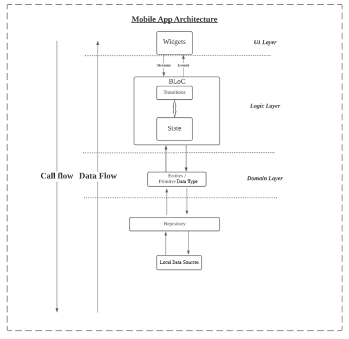

# Welcome

To-Do list app made with ♥ with Flutter.

## Getting Started

This project runs on Flutter 2.0.2 version.
#
## Demo

#
## Architecture Diagram

#
## Used packages
1. Flutter BLoC - To manage state efficiently
2. Device preview - To ensure the UI looks and feels stay persist in different devices during development
3. Flutter Form builder - Reduce the development time needed to create for form
4. Fimber - One of the best logging tool that i always use
5. SQLFlite - Persist data
